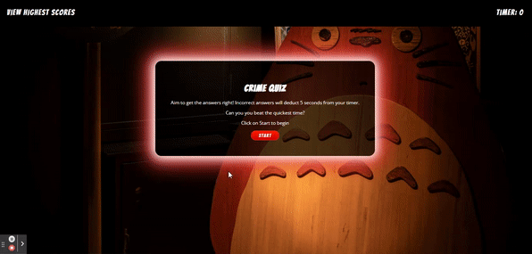
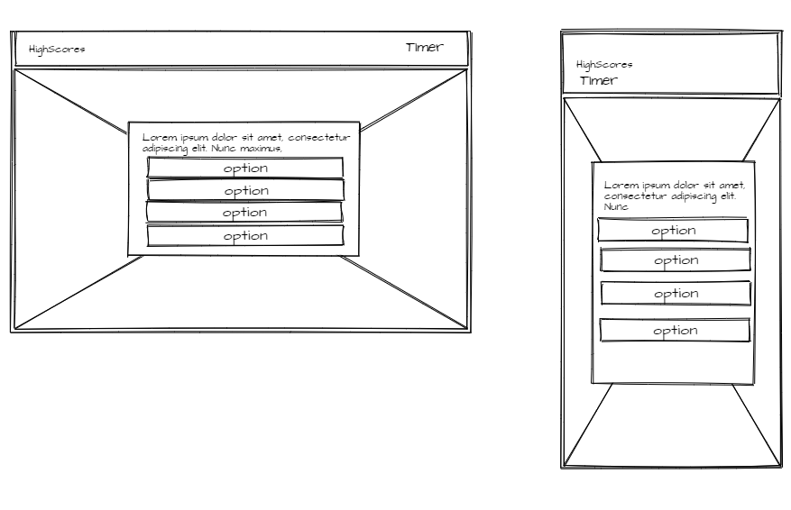

# True Crime Multiple Choice Quiz

A fully responsive, timed, multiple-choice 'true crime' quiz. This app will run in the browser and will feature dynamically updated HTML and CSS powered by JavaScript code.

#### You can view the deployed app by [clicking here!](https://fudge88.github.io/javascript-multiple-choice-challange/)

## Summary

A fun quiz, based on True Crime. The user has 40 seconds to answer 4 questions, every wrong answer will cost the user 5 seconds from their overall time. The highest number on the timer wins!



## User Story

```
I WANT to take a timed quiz on a true crime quiz that stores high scores
SO THAT I can gauge my progress compared to my peers
```

## Acceptance Criteria

```
GIVEN I am taking a crime quiz
WHEN I click the start button
THEN a timer starts and I am presented with a question
WHEN I answer a question
THEN I am presented with another question
WHEN I answer a question incorrectly
THEN time is subtracted from the clock
WHEN all questions are answered or the timer reaches 0
THEN the game is over
WHEN the game is over
THEN I can save my initials and my score
```

## Tools Used:

- Flexbox
- Media queries
- Font awesome
- Google fonts
- Keyframes

#### Languages:

- HTML
- CSS
- JavaScript

#### JavaScript Dynamic Elements:

Dynamic elements are just regular HTML elements that are actually created by the browser and only exist during runtime as part of the DOM. There are a handful of ways a dynamic element gets created.
Rather the creating a `<div>` like so in a HTML page, we would create a `<div>` using JavaScript as so:

` const divName = document.createElement("div");`  
`divName.setAttribute("class", "div-style");`  
`divName.setAttribute("id", "div-function");`

Here we create the element, and also assign attributes to the element in a similar way. The CSS attributes will still be picked up by style.css if linked and the new given style will be applied. Similarly the `id` would be called upon by a function if there is a function required for the element.

## Wireframes

The wireframe below, shows the skeletal plan of the app. The general concept was for the background and styling to stay the same, but the inner HTML content of teh center `<div>`to change upon user/function interaction.



## Features

- With minimal HTML, the app has been created using JavaScript.
- there is a timer that counts down from 40, giving teh user 10seconds per question
- for every wrong answer 5 seconds are deducted by the timer
- correct and incorrect answers both prompt an alert
- upon completion of the questions or upon the timer hitting '0' the game is over
- when the game is over a short series of animation takes place
- the user is then prompted by a input box to record their initials against the score
- the user is then redirected to the high scores page to view a table of historic scores
- there is a button for teh user to play again, which redirects back to the home page

## references:

[Background Image by Samuel Berner](https://unsplash.com/@saaam_chan?utm_source=unsplash&utm_medium=referral&utm_content=creditCopyText)

[Link glow effect](https://codersblock.com/blog/creating-glow-effects-with-css/)

[Flexbox positioning](https://developer.mozilla.org/en-US/docs/Web/CSS/CSS_Flexible_Box_Layout/Aligning_Items_in_a_Flex_Container)

[Webm to Gif converter](https://cloudconvert.com/webm-to-gif)

[Screencastify - screen recording](https://www.screencastify.com/)

[Mozilla.org](https://developer.mozilla.org/en-US/docs/Web/JavaScript/Reference/Global_Objects/Array/forEach)

[StackOverflow](https://stackoverflow.com/questions/9329446/for-each-over-an-array-in-javascript)

## License

This project is licensed under the terms of the MIT license.

